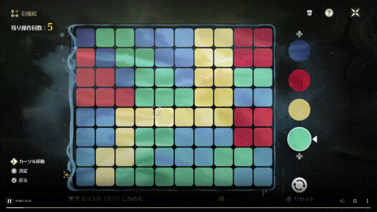
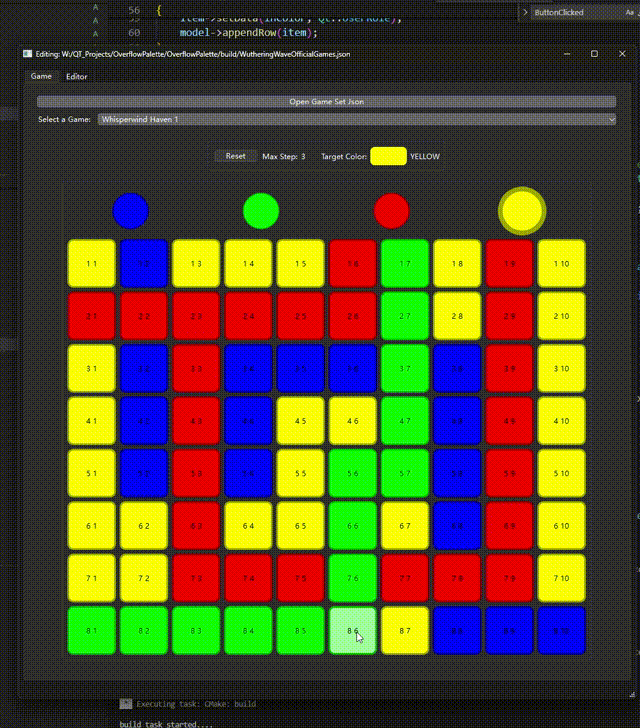

# 「鳴潮」の彩魔絵
本プログラムは「鳴潮2.0」で更新されたミニゲーム「彩魔絵」とそのエディタをQTで実現した．

ゲームの目標は制限された回数ですべてのマスを目標色に染めること．一回は一つのマスを選択し，そのマスを起点に、同じ色のマスが隣接しなくなるまで色が変化する．

参考資料：[https://game8.jp/meicho/662615](https://game8.jp/meicho/662615)

# プログラムについて
ゲームセット（彩魔絵の集まり）をロードする：

ゲームを切り替える：

勝利

失敗

途中リセット

# エディタについて
ゲームセットを作る：

既存するゲームセットをロード：

ゲームの名前を変更する：

ゲームの「最大回数」「目標色」を編集

マスのサイズを編集する

マスの色を編集：
三種類の指定方法：
1. 単一マスで設定
1. 単一マスでランダム拡張
1. すべてランダム拡張

色の追加：

色の削除：

色の編集（未実装）

本程序实现了鸣潮2.0类似的【溢彩画】的小游戏及其编辑器

该游戏的目标是在规定的步数以内，将所有的色块染成目标颜色。

虽然一步只能主动改变1个色块，但是色块

3种填充颜色的方式
通过JSON文件保存游戏
使用定时器减少程序阻滞
部分使用移动赋值
使用智能指针管理对象

UI动效
模块化Widget
